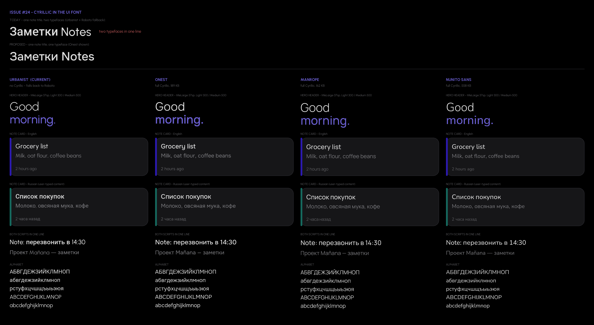

# Cyrillic-capable UI font — options for issue #24

**Status: awaiting a decision. Nothing in the app has been changed.**

A font swap rewrites every glyph in the app, so this branch deliberately stops at
the comparison. Pick a column and the change itself is a small one (see
[Applying the decision](#applying-the-decision)).

Regenerate with `pip install pillow fonttools && python render_font_comparison.py`.
The image is drawn from the real TTF outlines at the weights and sp sizes in
`core-ui/src/main/java/my/cheysoff/core_ui/theme/Type.kt`, so the glyphs shown are
the glyphs that would ship.

## The claim in the issue is correct

Read out of the four font binaries in `core-ui/src/main/res/font/`:

| file | glyphs | Latin | Russian (АБВ… абв…) | codepoints in U+0400–04FF |
|---|---|---|---|---|
| `urbanist_regular.ttf` | 487 | 62/62 | **0/66** | **0** |
| `urbanist_bold.ttf` | 487 | 62/62 | **0/66** | **0** |
| `urbanist_extra_bold.ttf` | 487 | 62/62 | **0/66** | **0** |
| `urbanist_variable.ttf` | 496 | 62/62 | **0/66** | **0** |

Not "sparse coverage" — the Cyrillic block is entirely absent from every file.

## What happens today: silent fallback, not tofu

Because the family cannot map the codepoint, Android's text layout re-shapes the
Cyrillic run in the next family of the system fallback chain — Roboto on stock
Android. The user sees legible Russian, so nothing looks broken; it just quietly
renders in a different typeface from the Latin text beside it. The top banner of
the image shows one note title, "Заметки Notes", drawn the way the device draws
it today: Roboto for the Cyrillic word, Urbanist for the Latin one.

The mismatch is easy to miss in isolation and obvious side by side: Urbanist is a
light geometric sans with circular bowls, Roboto is a narrower neo-grotesque with
a taller x-height. Mixed in one line they read as two voices.

**This only affects user-typed content.** The app has no `values-ru` and no
localised strings — every UI label is English. Cyrillic reaches the screen only
through note titles, note bodies, checklist items and folder names. That is why
the comparison leads with note cards rather than with chrome.

## The candidates

All three are SIL Open Font License 1.1 (same as the bundled Urbanist), all cover
Latin + full Russian, and all offer the five weights `Type.kt` asks for
(Light 300, Normal 400, Medium 500, Bold 700, ExtraBold 800).

| | file size | x-height | cap height | avg lowercase advance | wght axis |
|---|---|---|---|---|---|
| **Urbanist** (current) | 83 KB | 0.500 | 0.700 | 0.505 | 100–900 |
| **Onest** | 189 KB | 0.527 | 0.707 | 0.527 | 100–900 |
| **Manrope** | 162 KB | 0.540 | 0.720 | 0.503 | 200–800 |
| **Nunito Sans** | 558 KB | 0.484 | 0.705 | 0.491 | 200–1000 |

(Fractions of em. Sizes are the single variable font; the app currently also
ships three static instances, which a variable-only family would replace.)

What the numbers mean for the layout:

- **Onest** is the closest match in character — a geometric sans with the same
  circular bowls, and the one the code comment already nominated. It sets **~10%
  wider** than Urbanist (`n` 0.591 vs 0.536). The hero header is the place to
  check: "Good morning." and the longer daily phrases are near the screen edge at
  37sp already, and a wider face may wrap one of them.
- **Manrope** has the **largest x-height** of the three (0.540 vs 0.500). At the
  same sp sizes it will read noticeably larger and denser, which works against
  the airy Light-300 look the redesign is built around. Its weight axis stops at
  200, which is still below the 300 the app uses, so no weight is lost.
- **Nunito Sans** is the closest on metrics (x-height 0.484) but the furthest on
  character: it is humanist and rounded rather than geometric. It is also **6.7×
  the file size** of Urbanist and carries three extra variable axes
  (`wdth`, `opsz`, `YTLC`) that `FontVariation.Settings` would need to leave
  pinned at their defaults.

My reading: **Onest**, with the hero header checked on a narrow device before
merging. It is the only candidate that keeps the geometric voice the design
depends on, and the width cost is the one thing worth verifying on a real screen.
But this is exactly the call that should be made by eye, not by table — hence
this branch.

## Applying the decision

Once a family is chosen:

1. Drop its variable TTF into `core-ui/src/main/res/font/` (a variable font
   covers all five weights, so the three static Urbanist instances can go).
2. Rewrite `UrbanistFontFamily` in `Type.kt` to name the new resource, driving
   every weight off the `wght` axis with `FontVariation.Settings`, and rename the
   val to match the family.
3. Delete the `TODO(font)` block at the top of `Type.kt`.
4. Check the hero header, the note cards and the editor on a narrow device with
   mixed Latin/Cyrillic text — the acceptance criterion in the issue.

Note that a single dual-script family is required rather than adding a Cyrillic
font alongside Urbanist: Compose resolves a `FontFamily` by weight and style, not
per script, so listing two families does not produce per-script fallback.
